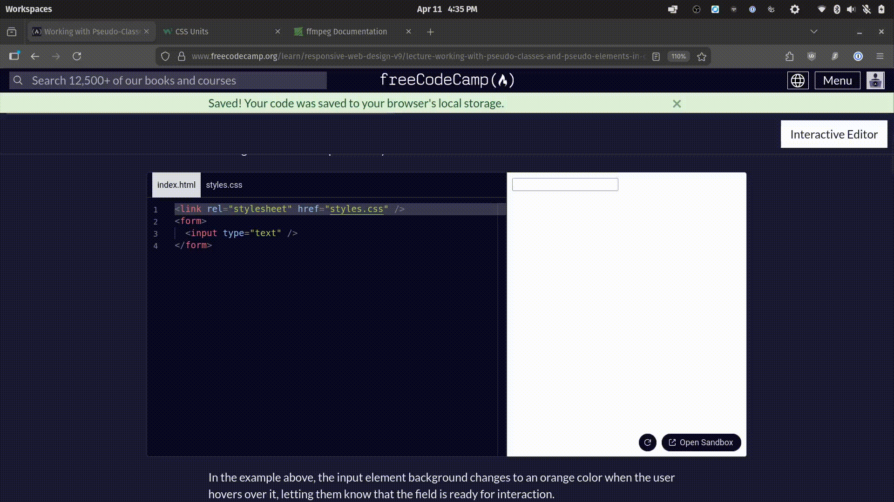
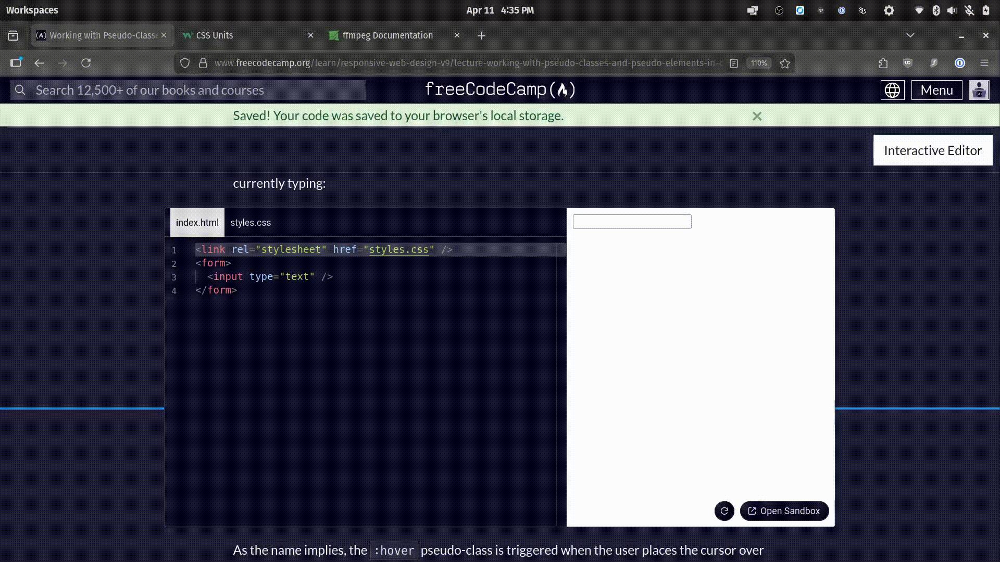

# Introduction
A  mix of things I copy + pasted and wrote down from freeCodeCamp 
to use as reference in the future.

# HTML

## Accessibility

### ARIAs
ARIA stands for Accessible Rich Internet Applications. You can use ARIAs 
to give semantic meaning to div tags, i.e. scrollbar, searchbox etc.

Six main categories of ARIAs
1. Document structure roles
2. Widget roles
3. Landmark roles
4. Live region roles
5. Window roles
6. And Abstract roles

* `aria-hidden`: Used to hide elements from accessibility trees for tools like screen readers.
* The `accesskey` attribute in a button element, can assign a key to activate a button. 


# Computers
## File Organisation

Example folder structure for a HTML and CSS project.
```
.
├── /assets
│   ├── /images
│   │   ├── logo.png
│   │   ├── banner.jpg
│   │   └── icons.svg
│   ├── /fonts
│   │   ├── custom-font.woff
│   │   └── custom-font.woff2
├── /css
│   ├── main.css
│   ├── about.css
│   └── contact.css
├── index.html
├── about.html
├── contact.html
└── README.md
```

Associating `<labels>` and `<input>`: the `for` attribute of the `<label>` must match the `id` attribute of the `<input>`.

# CSS

## Basics
A CSS rule is made of a **selector** and a **declaration** block.

```css
selector {
  property: value;
}
```
Selector: Specify which HTML element you are styling

Declaration Block: The block within the curly braces.

Property: CSS identify that specidies which feature is being styled. (i.e. background-color)

Example:

```CSS
p {
  color: blue;
}
```

=> All text within paragraph tags become blue.

Appling styles to multiple selectors: Create a selector list, with each selector separated by a comma. 

`id` selectors start with a hash `#` symbol, class selectors start with a dot `.`. (see example below)

Example:
```
#title,
.subheading {
  color: navy;
}
```

**Meta Viewport**
A special HTML meta element that instructs a browser on how to control the page's dimensions on different devices.

```
<meta name="viewport" content="width=device-width, initial-scale=1.0">
```

width=device-width: Set the width of the page to your device's width

initial-scale=1.0: Set the initial zoom level to 100% once loaded. 

If the auto scaling is not set then the mobile device will load the desktop verison. 

**Types of CSS**
* Inline
Written directly within the HTML.

Example
```html
<p style="color: green;">This is an inline-styled paragraph.</p>
```
Useful quick one offs.

* Internal
Written inside html, at the top of the HTML page, contained within the HTML. Inside the `<style>` tag, inside the `head` section of a page.

Example

```html
<head>
  <style>
    p {
      color: blue;
    }
  </style>
</head>
```

Good for styling an individual page, and is not repeated in other pages. 

* External
Written in a `.css` file and imported to the HTML; good for reusability.

```css
# styles.css
p {
  color: red;
}
```

```html
# HTML file
<head>
  <link rel="stylesheet" href="styles.css">
</head>
```
Inside `link` there's

- `rel`: Specify relationship between current doc and linked resource
- `href`: Link to the resource (i.e. stylesheet location)

External CSS should be go-to; Seperation of concerns and reusability.

**width/height**

You can define width and height with the following units
- `px`
- `%`
- `vw` 
- `vh`

vw, wh -> viewport units

Width and height's default is set to auto.; i.e. For a div element, `wdith: auto` makes the element expand to fit the full width/height of its parent container.

You can add min-height and min-width to add more constraints; For instance, if you want the box to be at least some size, but you allow it to get bigger.

Example
```html
<head>
  <style>
    .box {
      width: 50px;
      min-width: 100px;
      height: 50px;
      min-height: 100px;
      background-color: lightcoral;
    }
  </style>
</head>
<body>
  <div class="box"></div>
</body>
```

Remember, that your style is in your `head` tag and then you actually have to create the element in the body to see the effects of your style. 

You also have `max-height` and `max-width`, which does the converse - overrides the element's size if the limit is reached. Max acts a a cap, Min acts as a booster.

**CSS Combinators**
Allows for precise styling by helping to select elements based on relationship to other elements.

- Descendant Combinator (` `)
To target an element that is nested in another element.

i.e. If we want to make the image border red, but the `img` tag is inside figure, we do

```css
# styles.css
figure img {
  border: 4px solid red;
}
```

The syntax is to put a space between the parent and child selectors.

- Child Combintor (`>`)
Select elements that are a direct child of the specified parent element

i.e. 
```css
.container > p {
  color: blue;
}
```

^means that you only want to turn the text of the `p` tag within the `container` class blue. If the container contains more stuff, no styles are applied there.

- Next-sibiling Combinator (+)
Selects an element that immediately follows a specified sibling element.

```css
img + figcaption {
  border: 4px solid black;
}
```
^ Changes the `figcaption` border black; img is like the pointer. Compared to parent-child relationship, you are specifying elements laterally. 

- Subsequent-sibling Combinator (`~`)

```css
h2 ~ p {
  color: green;
}
```
Selects all siblings of a specified element that come after it. In the example above, all the `p` text nested inside your `h2` tag turn green.


**Inline vs Block-Level Elements**
* Block Level
   * Always start on a new line, and push other content to the next line => creating a block. Takes up the full width available to them by default. So if they're in a container like a `<body>` then it will take the width of the `<body>`.
   * Have the CSS property `display: block;` applied by default. 
   * Examples: `div`, `p`, `ol` etc.
* Inline Elements
  * Take up as much width as they need, do not start on a new line; Inline elements flow within content
  * Have the CSS property `display: inline;` 
  * Examples: `span`, `anchor`, `img`

* Inline-Block
  * Hybrid of inline and block behaviours. 
  * Does not start on a new line; But you can adjust the width and height of an inline-block. Pure inline blocks cannot have their size controlled.
  * Have the CSS property `display: inline-block`
  * Example
  ```html
  <link href="styles.css" rel="stylesheet">

  <div class="container">
    <span class="inline-block-element element1">Inline-Block</span>
    <span class="inline-block-element element2">Inline-Block</span>
  </div>
  ```

**Margins and Padding**
* Margin
  * `margin-top`
  * `margin-right`
  * `margin-bottom`
  * `margin-left`
  * `margin` <- apply value to all four sides of the target element
  * Example:
  ```css
  p {
      margin: 10px;
    }
  ```  
  * If two values are provided like 10px 20px, 10px: `top` and 20px:`bottom`, second value is apply left and right. 
  * If three values are provided: 10px 20px 30px, then 10px: `top`, 20px: `left` and `right` and 30px: `bottom`
  * Four values 10px 20px 30px 40px then 10px:`top`, 20px: `right`, 30px: `bottom`, 40px: `left` (clockwise assignment)

An aside: `<span>` is inline, `<p>` is block-level.

* Padding
  * Used to add space <em>inside</em> the element, between the content and its border.
  * `padding-top`
  * `padding-right`
  * `padding-bottom`
  * `padding-left`
  * Example
    ```css
    p {
      padding-top: 10px;
      padding-right: 20px;
      padding-bottom: 30px;
      padding-left: 40px;
      border: 2px solid black;
    }
    ```
  * Follows the same shorthand rules as margin.


**CSS Specificity**

Determins which styles are applied, even when multiple rules could apply. A similar concept would be scope in Python.

Highest specificity (higher priority): `style` attribute

`style` > ID selectors > class/attribute/pseudo-classes > type selectors > universal selector

Class selectors: `.container`
Attribute selectors: `[type="text"]`
Pseudo-classes: `:hover`
Types: `div`, `h1`
Universal: `*`

When two rules share equal specificity, the one that appears later in the document wins. i.e. If the external stylesheet is linked after an internal `<style>` then the external stylesheet takes precedence.

You can use the universal seelctor `*` to remove any default/built in styles.

Nuclear option: `!important` next to the value in the CSS file; Overrides any other declaration.

Usage example:
```html
<link rel="stylesheet" href="styles.css">

<p class="para" style="background-color: lightblue; color: black;">
  This is a paragraph.
</p>
```

```css
.para {
  background-color: black !important;
  color: white !important;
}
```


**Inheritance**
Example - if you have a `div` style with text set to blue, then the `p` child element will also be blue. But not all properties are inherited by default. 

Inherited properities include `color`, `font-family`, `line-height`.

Uninherited properties include `margin`, `padding`, `border`, `background`; Unless explicity stated, i.e. using the `inherit` keyword.

Example: Inheritting the padding style of the parent element
```html
<div style="padding: 20px;">
  This is the parent element with padding.
  <p style="padding: inherit;">This is the child element inheriting the padding.</p>
</div>
```
You can use `line-height` to adjust the spacing between lines of a single list item; without affecting the spacing <em>between</em> list items.

To control spacing between list items, you would use `margin` or `padding` instead applied to the class/element selectors instead.

**list-style properties**
* `list-style-type`
  Adjust the type of bullet point or number style.
  i.e. change to bullets to squares or change numbers to roman numerals
* `list-style-position`
  Controls position of bullet or number in relation to the list item's content
  * `inside`: Bullet or number appears inside content
  * `outside`: Bullet or number appears outside content
  * Can be used to align content for multiple bullet points
* `list-style-image`
  * Allows you to use an image as the bullet point for your list item.
* `list-style`
  * Combine all three into 1 shorthand. 
  * Example
  ```html
  <ul style="list-style: square inside url('https://cdn.freecodecamp.org/curriculum/cat-photo-app/relaxing-cat.jpg');">
    <li>Item 1</li>
    <li>Item 2</li>
    <li>Item 3</li>
  </ul>
  ```

**Link States**
- `link`
- `visited`
- `hover`
- `focus` (adds a border when you click and hold or when your keyboard focuses on it, like when you press tab)
- `active`

You can style link states using `pseudo-classes` in CSS. 

`pseudo-class` syntax
```css
A:B {
  property: value;
}
```

A: Selector
B: Pseudo-class

Instantiated example
```css
/* Visited link */
a:visited {
  color: green;
}
```

No text declarations for `<a>` tag:
```css
a {
    text-decoration: none;
}
```

**Background Images**

Properties

* `background-size`
* `background-repeat`
* `background-position`
* `background-attachment`

`background-image` example:

```html
<style>
  body {
    background-image: url("https://cdn.freecodecamp.org/curriculum/cat-photo-app/relaxing-cat.jpg");
  }
</style>
```

`contain` will scale the image as large as possible without cropping or stretching.;
See documentation for other values of each property (key).
```html
<style>
  body {
    background-image: url("https://cdn.freecodecamp.org/curriculum/cat-photo-app/relaxing-cat.jpg");
    background-size: contain;
    min-height: 100px;
  }
</style>
```

Accessibility concerns for background:

- Sufficient contrast ratio of 4.5:1 for normal text and 3:1 for large text.

**Design**

Def Layout

How visual elements are arranged on a screen/page.

Def Alignment

How elements are placed in relation to one another.

Def Composition

Arranging elements to create a harmonious design.

Def Balance

How visual weight is distributed within a composition. i.e. You can 
create an balance through symmetrical or asymmetrical arrangements.
A balanced design feels harmonious.

Def Hierarchy

Order of importance in a design. You can implement visual hierarchy with
size, color, contrast, alignment, white space, and even typography.

**User Research**

Net Promoter Score - Measures how likely your users are to recommend
your product to a friend.

Breadcrumbs - If you have a complex site, then you can have a a nav bar or footer to show the user where they are.

Cards - Populat in e-commerce, social media and news sites; Good for displaying information in a structured way. Each card should have a minimal design, not too cluttered.

Progress indicators - Let users know how far they are into the process, and what's left t odo; i.e. In your grad apps, there's a nav bar with the steps. It gets filled with color when you're done and greyed out if not.

CTA - A Call-to-Action: Usually a button that's highlighted (high contrast) for the user to proceed with the next step, i.e. "Proceed to Checkout" if it's a e-commerce site.

Progressive Disclosure - Allow users to select what they want to see, usually information that is most relevant for them at that moment. An example would be like a "more details" button. It is desirable to provide a single, clear access point to additional informtiaon, so don't have too many "More Details" buttons.

Design Briefs - A document that outlines the objectives, goals and requirements of a project. 

**Absoulte and relative units**

A pixel, `px`, is a 1/96th of an inch. It always will be, regardless of the screen size.

Generally you use pixels if you want precise control over element dimensions, like margins or padding.

Other types of absolute units.

* The `in` (inches) unit, which is equal to 96px
* The `cm` (centimeters) unit, which is equal to 25.2/64 of an inch
* The `mm` (millimeters) unit, which is equal to 1/10th of a centimeter
* The `q` (quarter-millimeters) unit, which is equal to 1/40th of a centimeter
* The `pc` (picas) unit, which is equal to 1/6th of an inch
* The `pt` (points) unit, which is equal to 1/72th of an inch

Percentages - i.e. `width: 50%`; Can be used for
- Scaling images or container heights and widths
- Adjusting the position of stuff, using the `transform` property.
  ```CSS
  .centered {
  position: absolute;
  top: 50%;
  transform: translateY(-50%);
  width: 300px;
  height: 300px;
  background-color: red;
  }
  ```
  ^top is wrt to the container. i.e. Make this 50% of its container.

  ^transform is wrt the element itself. i.e. Move this up 50% of the shape's height.

`ems`: Relative to the font size of the element. i.e. if your `<p>` tag already
has a font size of `20px` and you specify its `margin-bottom` property to be `1.5em`, then
you're specifying `margin-bottom: 30px` since $20 \times 1.5 = 30$.

Use case for `ems`: For ensuring modular components like buttons or cards scale
relative to font size. So you can specify their properties with the `em` unit.

`rems`: Think of it as a universal scaler. It will scale your text relative to the
html tag, and so scale proportionally to the browser settings. 

i.e. 
```CSS
.para {
  font-size: 1.2rem;
  margin-bottom: 1.5em;
  border: 2px solid red;
}
```

`vh` and `vw`: Viewport-relative units, scale elements based on dimensions of the browser windows. A viewport is the visible area of the browser window, used to match content with the device. Like mobile vs desktop.

`1vh`: 1%of the viewport height. 

```CSS
h1 {
  font-size: 5vw;
}
```
^ Means that the font size of your `<h1>` will always be 5% of the viewport's width.

Use `calc()` when you want to mix relative units.
```CSS
 #div1 {
  position: absolute;
  left: 50px;
  width: calc(100% - 100px);
  border: 1px solid black;
  background-color: yellow;
  padding: 5px;
  text-align: center;
}
```

The width is 100% minus 100 pixels. Remember to add whitespace around the operands.

**Pseudo-classes**
CSS keywords that allow you select a specific state of a HTML element.
i.e. A link only when it's active. (see below)
```CSS
button:active {
  background: greenyellow;
}
```
or first child/last child of an element (tree-structural pseudo-classes)
```CSS
.container p:first-child {
  background: lightcoral;
  padding: 0.4rem;
}
```

```CSS
.container p:last-child {
  background: lightcoral;
  padding: 0.4rem;
}
```
Other pseudo-classes

- `:focus`
- `:first-of-type`
- `:last-of-type`
- `:nth-of-type`
- `:modal`
- `:enabled`
- `:checked`
- `:required, and more.`

You can check out input pseudo-classes to guide users on the state of their
input. I like `:hover` and `focus`




List of tree-structural pseudo-classes:

* `:root`
* `:empty`
* `:nth-child(n)`
* `:nth-last-child(n)`
* `:first-child`
* `:last-child`
* `:only-child`
* `:nth-of-type`
* `:first-of-type`
* `:last-of-type`
* `:only-of-type`

Functional pseudo-classes

- `:is()`: For style group of elements that share some but not all characteristics.
  ```CSS
  :is(button, a.button, input[type='submit'], input[type='reset']) {
    background-color: darkblue;
    color: white;
    border: 1px solid darkblue;
    padding: 10px 20px;
    text-decoration: none;
    border-radius: 5px;
    cursor: pointer;
    display: inline-block;
    margin: 5px;
    font-size: 16px;
    text-align: center;
  }

  :is(button, a.button, input[type='submit'], input[type='reset']):hover {
    background-color: blue;
    border-color: blue;
  }
  ```

- `:where()`: Grouping selectors, but specificity is lowest priority
  ```CSS
  :where(h1, h2, h3) {
  margin: 0;
  padding: 0;
  }
  ```
- `:has()`: Styling a parent element based on its children's states.
  ```CSS
  article:has(h2) {
    border: 2px solid hotpink;
  }
  ```
  ^ Applies a 2px hotpink border to any article that has a h2 child.
- `:not()`: Select based on something the element does *not* have.
  ```CSS
  button:not(.primary) {
  background-color: grey;
  }
  ```
  ^ Makes buttons grey if they are *not* primary buttons.

**Pseudo-elements**
Recall- Single colon is for pseudo-class, but now double colon is for pseudo-elements.

```CSS
selector::pseudo-element {
  property: value;
}
```

You need a originator (which is a like a reference) element when you write pseudo-elements. Pseudo-elements cannot exist independently.

```CSS
.cta-button {
  background-color: lightseagreen;
  color: white;
  border: none;
  padding: 10px 20px;
  cursor: pointer;
  position: relative;
}

.cta-button::before {
  content: "⭐";
  position: absolute;
  left: 3px;
  top: 8px;
  font-size: 0.75rem;
}
```

^ Adds a ⭐ before the text for the `cta-button` class.

**Colors**
Colors can be represented through color models, i.e. RGB model, HSV (hue, saturation, value) model, HSL (hue, saturation, lightness) model. <- Two popular ways to represent a spectrum of colors.

Analogous color schemes create cohesive and soothing experiences. They have analogous colors, which are adjacent to each other in the color wheel.

Complementary color schemes create high contrast and visual impact. Their colors are located on the opposite ends of the color wheel, relative to each other.

RGB color wheel: Complementary colors are located at the opposite ends of the wheel.

RGM in CSS
```CSS
element {
  color: rgb(red, green, blue);
}
```
There's also `rgba(red, green, blue, alpha)`.

HSL in CSS
```CSS
element {
  color: hsl(hue, saturation, lightness);
}
```
Hue is an angle on the color wheel, which ranges from 0 to 360.
Also you can add the `a` behind to get the alpha.

A hex code is a six-charactern string that represents color in the RGB color model.
Hex - base-16 numbering system which uses digits `0` to `9` and letters `A` to `F`.

Each hex starts with a `#` and is followed by 6 characters.

Each pair in the hex is for R, G and B. i.e. #RRGGBB. Then `00` is the lowest intensity, and `FF` is the highest intensity.

**Color Gradients**
Two types: 
1. Linear (single direction)
2. Radial (from center of element, in all directions i.e. circular or elliptical)

```CSS
.linear-gradient {
  background: linear-gradient(to right, red, blue);
  height: 40vh;
}
```
^ `to right` is the direction of the color gradient.


```CSS
.custom-radial-gradient {
  background: radial-gradient(ellipse at top left, red, blue);
  height: 40vh;
}
```
`ellipse at top left`: You can specify the starting point and shape of your radial color gradient.

You can also specify specific color stops at precist points by adding percentage next to the color.

```CSS
.precise-gradient {
  background: linear-gradient(to right, red 20%, yellow 40%, blue 80%);
  height: 40vh;
}
```

**Styling Text Inputs**

- Remember to have enough contrast
- Remember to add placeholder
- Input should scale accordingly when user zooms the page
- Use Javascript to update the error state, i.e. invalid email address

`appearance: none` to remove default browser styling and allow custom styling.

Check out input[type="color"] <- HTML, CSS native color picker. Cool!

input[type="date"]: Shows a calendar

**Overflow**

The way of handling content that exceeds the size of its containing element.
i.e. Text content of a div element overflowing from its borders.

Overflow happens in the x and y dimensions. 

Values for overflow properties:

- `hidden`
- `scroll`
- 

i.e.
```CSS
div {
  height: 200px;
  overflow-y: hidden;
}
```

`transform` property: Modify visual presentation of elements without affecting
the layout of other elements. (2D or 3D transforms)

Transform functions:
- `translate()`
- `rotate()`
- `scale()`

i.e.
```CSS
.box {
  transform: translate(50px, 50px) rotate(45deg) scale(1.5);
}
```

**CSS Box Model**

Every element is surrounded by a box, consisting of four elements

1. content area
   
   The innermost part of the box; contains like text or images

2. padding
   
   The area immediately after the content area; Space between content area and
   border

3. border
   
   Outer edge or outline of an element in the CSS box model

4. margin
   
   Space outside the border of an element; Distance between an element and
   other elements around it.

Margin Collapsing is a behaviour that occurs when vertical margins of adjacent
elements overlap

For example, if you have two boxes, box 1 which sits on top of box 2.

If box 1 has a `margin-bottom` property set and box 2 has a `margin-top` property
set, there will be a clash.

i.e.
```CSS
.box1 {
  margin-bottom: 20px;
  background-color: lightblue;
}
.box2 {
  margin-top: 30px;
  background-color: lightgreen;
}
```

^ instead of 20 + 30 = 50px of space; The margin will collapse to 30 pixels, which
is the larger of the two margins.


`box-sizing` can be set to `content-box` or `border-box`.

As the name suggests `content-box` is used for precise control over the content
area, does not control padding, border or margin. i.e. When you set width and height
for `content-box`, you are only setting the size of the content.

For `border-box`, the width and height you set will include the element's content,
padding, and border (But not margin); Use `border-box` to make the element's total size
stay fixed even if padding or borders change. Helpful for responsive layouts.


```CSS
* {
  box-sizing: border-box;
}
```

CSS reset - remove all or some of the default formatting given by web browsers.

You can create a custom CSS reset to have a consistent theme for your whole
website.

Examples of third part CSS resets:

1. `Normaliza.css`
2. `sanitize.css`

**CSS Filter Property**

CSS `filter` property is for aplying graphical effects to elements on a web page.

General structure of `filter` property:
```CSS
selector {
  filter: function(amount);
}
```

Example of using a combination of filter functions.
```CSS
img {  
  filter: contrast(150%) brightness(110%) sepia(30%);  
}
```
Filters:

1. `blue`
2. `brightness`
3. `grayscale`
4. `sepia`
5. `hue-rotate`
6. `constrast`
7. `invert`
8. `saturate`


**Flexbox**

Flex container: An HTML element with a flex layout; Can arrange and align elements 
in various ways within a flex container. 

Flex item: Direct children of a flex container. 

Other flex properties
1. `flex-direction` 
2. `justify-content` 
3. `align-items` 
4. `flex-wrap`

Each flex container has two axes: 
- The main axis
- The cross axis (perpendicular to the main axis)

`flex-direction`
- `flex-direction: row-reverse;` 
- `flex-direction: column;` 
- `flex-direction: column-reverse;`


`flex-wrap`

^Determines how flex items are wrapped within a flex container to fit the available space.
- `flex-wrap: nowrap;`
- `flex-wrap: wrap;`
- `flex-wrap: wrap-reverse;`

`justify-content`

^Aligns child elements along the main axis of the flex container.
-  `justify-content: flex-start;`
-  `justify-content: flex-end;`
-  `justify-content: center;`
-  `justify-content: space-between;`
-  `justify-content: space-around;`
-  `justify-content: space-evenly;`
  
`align-items`

^Distributes items along the cross axis
- `align-items: center;`
- `align-items: flex-start;`
- `align-items: flex-end;`
- `align-items: stretch;`


`align-self`

^Assign different alignment on cross axis to an individual flex item.
- `align-self: stretch;`
- `align-self: center;`
- `align-self: flex-end;`

`flex-flow`

^Shorthand for `flex-direction` and `flex-wrap`.
- `flex-flow: column wrap-reverse;`

**Typography**

The art of choosing the right fonts and format to make text visually appealing and
easy to read.

"Type" - how individual characters are designed and arranged. 

"Typeface" - overall design and style of a set of characters, numbers and symbols.

"Font": A variation of a typeface with specific characteristics like size, weight, style and width.

- The baseline is the imaginary line on which most characters rest.
- The cap height is the height of uppercase letters, measured from the baseline to the top.
- The x-height is the average height of lowercase letters, excluding ascenders and descenders.
- Ascenders are the parts of lowercase letters that extend above the x-height, such as the tops of the letters h, b, d, and f.
- Descenders are the parts of lowercase letters that extend below the baseline, such as the tails of y, g, p, and q.

Best practices for working with typography:

- Readability: Large fonts, short lines. Use font size for visual hierarchy.
- Add option to increase font size.

Font-family: Group of fonts that share a common design.

at-rules:  Can be used to define various aspects of the stylesheet like
media queries, keyframes, font faces and more.

General format
```CSS
@font-face {
  /* Descriptors */
}
```

Specific example to define custom fonts.
```CSS
@font-face {
  font-family: "MyCustomFont"; 
  src: url("path/to/font.woff2") format("woff2"),
    url("path/to/font.otf") format("opentype") tech(color-COLRv1),
    url("path/to/font.woff") format("woff");
}
```

**Working with external fonts**
Two examples of externally hosted font sources:
- Google Font
- Font Squirrel

An example of listing out different google fonts.

HTML:
```HTML
<link rel="preconnect" href="https://fonts.googleapis.com">
<link rel="preconnect" href="https://fonts.gstatic.com" crossorigin>
<link href="https://fonts.googleapis.com/css2?family=Roboto:ital,wght@0,100;0,300;0,400;0,500;0,700;0,900;1,100;1,300;1,400;1,500;1,700;1,900&display=swap" rel="stylesheet">
<link rel="stylesheet" href="styles.css">

<p class="roboto-thin">roboto-thin</p>
<p class="roboto-light">roboto-light</p>
<p class="roboto-regular">roboto-regular</p>
<p class="roboto-medium">roboto-medium</p>
<p class="roboto-bold">roboto-bold</p>
<p class="roboto-black">roboto-black</p>

<p class="roboto-thin-italic">roboto-thin-italic</p>
<p class="roboto-light-italic">roboto-light-italic</p>
<p class="roboto-regular-italic">roboto-regular-italic</p>
<p class="roboto-medium-italic">roboto-medium-italic</p>
<p class="roboto-bold-italic">roboto-bold-italic</p>
<p class="roboto-black-italic">roboto-black-italic</p>
```

CSS:
```CSS
.roboto-thin {
  font-family: "Roboto", sans-serif;
  font-weight: 100;
  font-style: normal;
}

.roboto-light {
  font-family: "Roboto", sans-serif;
  font-weight: 300;
  font-style: normal;
}

.roboto-regular {
  font-family: "Roboto", sans-serif;
  font-weight: 400;
  font-style: normal;
}

.roboto-medium {
  font-family: "Roboto", sans-serif;
  font-weight: 500;
  font-style: normal;
}

.roboto-bold {
  font-family: "Roboto", sans-serif;
  font-weight: 700;
  font-style: normal;
}

.roboto-black {
  font-family: "Roboto", sans-serif;
  font-weight: 900;
  font-style: normal;
}

.roboto-thin-italic {
  font-family: "Roboto", sans-serif;
  font-weight: 100;
  font-style: italic;
}

.roboto-light-italic {
  font-family: "Roboto", sans-serif;
  font-weight: 300;
  font-style: italic;
}

.roboto-regular-italic {
  font-family: "Roboto", sans-serif;
  font-weight: 400;
  font-style: italic;
}

.roboto-medium-italic {
  font-family: "Roboto", sans-serif;
  font-weight: 500;
  font-style: italic;
}

.roboto-bold-italic {
  font-family: "Roboto", sans-serif;
  font-weight: 700;
  font-style: italic;
}

.roboto-black-italic {
  font-family: "Roboto", sans-serif;
  font-weight: 900;
  font-style: italic;
}
```

`text-shadow`

```CSS
p {
  text-shadow:
   3px 2px 3px #00ffc3,
   -3px -2px 3px #0077ff,
   5px 4px 3px #dee7e5;
}
```

First value controls the `X` offset and second value controls the `Y` offset., third is the blur radius of the shadow, last is the color (can be put and the front or the back).

You can have multiple `text-shadow` layers, it will be applied from the top to the bottom.

**Color contrast checking**: [WebAIM's Color Contrast Checker](https://webaim.org/resources/contrastchecker/). Compare your text (foreground) against the background color (background).

**Hiding Content**:

- `display: none;`: Removes the content both visually and from the accessibility tree, so screen readers won't access the content.
- `visibility: hidden`: Hides the content visually but still lets the element occupy space on the page. Also removes the content from the accessibility tree.
- `.sr-only`: CSS class that hides content visually but keeps it accessibile to screen readers.
- `hidden`: An attribute you can add to your element tags, i.e. `<p hidden> </p>`, hides content both visually and from accessibility tree.


**Floats**: To allow text to wrap around an element, like an image. Take an element out of the normal document flow and push it to the left or right of the container. 

**Relative Positioning**: Assing the position of elements relative to another element.

**Absolute Positioning**: Takes an element out of the normal document flow and make it behave independently from other elements. i.e useful for creating elements that track the user's POV - tooltips, dropdown menus etc.

```CSS
.positioned {
  position: absolute;
  top: 30px;
  left: 30px;
  background-color: coral;
}
```

**Fixed and Sticky Positioning**: `fixed` removes the element from the normal document flow, and places it relative to the viewport. i.e . for nav bars that need to be visible at all times.`sticky` is a hybride of relative and fixed positioning; Stays within the flow of the doc, but once the user scrolls and certain point, it switches to `fixed` behaviour. 

Example of a fixed header element
```CSS
h1 {
  position: fixed;
  top: 0;
  width: 500px;
  background: white;
  padding: 10px;
  border-bottom: 2px solid #ccc;
}
```

Difference between `fixed` and `absolute` is the reference point. `fixed` positions the element relative to the viewport while `absolute` positions the element relative to the nearest positioned ancestor.

**Z-Index**: `z-index` controls vertical stacking order of positioned elements. Works for all position values except `static` (`relative`, `absolute`, `fixed`). Default `z-index` is zero. 


